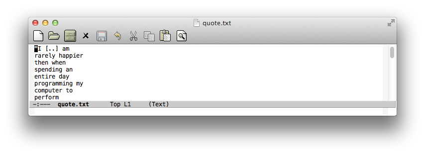
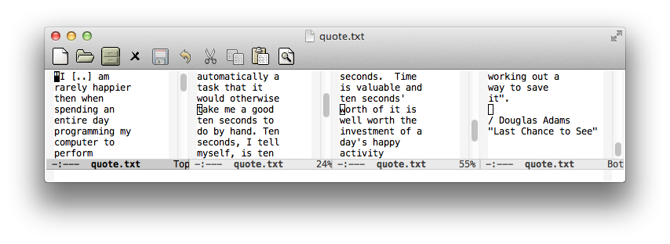

# multicolumn - Creating and managing multiple side-by-side windows

*Author:* Anders Lindgren 
*Version:* 0.1.1 
*URL:* [https://github.com/Lindydancer/multicolumn](https://github.com/Lindydancer/multicolumn) 

Commands helpful when using multiple side-by-side windows.

## Overview

Using multiple side-by-side windows is a great way to utilize the
large high-resolution displays that exists today. This package
provides the "missing features" of Emacs to create a side-by-side
layout, to navigate efficiently, and to manage the windows.

This package is especially useful in conjunction with Follow mode,
a package provided with Emacs that create the illusion that several
windows showing the same buffer form a very tall virtual window.
For example, I use six side-by-side windows spread out across two
monitors, which lets me see 888 consecutive lines of code.
Concretely, this allows me to see all of the code in this package
at once.

## Example

In the screenshots below, a text is being edited which is narrower
but taller than the Emacs frame.

With `multicolumn-delete-other-windows-and-split-with-follow-mode`
four equally spaced side-by-side windows are created and Follow mode
is enabled, which makes it possible to see the entire text at once.

## Usage

This package provides a number of functions for creating and
managing multiple side-by-side windows. It also provides
Multicolumn global mode that binds a number of keys to the
functions.

## Installation

Place this package in a directory in the load-path. To activate it,
use *customize* or place the following lines in a suitable init
file:

       (require 'multicolumn)
       (multicolumn-global-mode 1)

## Creating side-by-side windows

* <kbd>C-x 3</kbd> (`multicolumn-delete-other-windows-and-split`) creates
a number of side-by-side windows. The number of windows it creates
depends on the width of the frame and on `multicolumn-min-width`.
With a numerical argument, create this many windows.
* `multicolumn-delete-other-windows-and-split-with-follow-mode`
does the same and enables Follow mode, so that one buffer takes
over where the previous buffer ends. This gives you an
unprecedented overview of the buffer.
* <kbd>C-x 4 u</kbd> (`multicolumn-pop-window-configuration`) restored the
previous windows layout.

## Resizing the frame

* `multicolumn-resize-frame` resizes and repositions the frame
to accommodate side-by-side windows of a specific width. You can
use this as an alternative to using a full-screen mode.
* `multicolumn-resize-and-split-frame` resizes and positions
the frame and creates a number of side-by-side windows. This
function can be called from to suitable init file to ensure that a
number of side-by-side windows are created when Emacs is started.

## Navigation

* <kbd>C-M-<</kbd> (`multicolumn-select-first-window`) and <kbd>C-M-></kbd>
(`multicolumn-select-last-window`) select the leftmost and rightmost
window, respectively.
* <kbd>C-x 4 p</kbd> (`multicolumn-select-previous-window`) selects the
previous windows. This package does not provide a function to
select the next. However, it binds <kbd>C-x 4 n</kbd> to `other-window`.
* <kbd>C-x 4 DIGIT</kbd> (`multicolumn-select-window-number`) go to window
  number DIGIT, where 1 is the leftmost.
* <kbd>C-x 4 :</kbd> (`multicolumn-select-minibuffer`) go to the minibuffer.

## Window content management

* <kbd>C-x 4 t</kbd> (`multicolumn-transpose-windows`) swaps the content of
the current and the next window.
* <kbd>C-x 4 <</kbd> (`multicolumn-extend-left`) and <kbd>C-x 4 ></kbd>
(`multicolumn-extend-right`) displays the current buffer in the
previous and next windows, respectively.
* `multicolumn-collect-windows` ensures that all windows displaying
the same buffer becomes adjacent.

## Trackpad support

* <kbd>C-wheel-left</kbd> and <kbd>C-wheel-right</kbd> selects the next and previous
window using `multicolumn-trackpad-select-previous-window` and
`multicolumn-trackpad-select-next-window`, respectively.
* <kbd>M-wheel-left</kbd> and <kbd>M-wheel-right</kbd> selects the first and last
window using `multicolumn-trackpad-select-first-window` and
`multicolumn-trackpad-select-last-window`, respectively.

## Configuration

Unfortunately, it's hard from within Emacs to find out information
about the environment outside Emacs, for example a window manager
may reserve parts of the screen. This package tries to contains
information for as many systems as possible, however, you may need
configure this package to match your system.

See variable is the source code for how to configure this package.

## MS-Windows Notes

### Width of multiple monitor display

The functions `display-pixel-width` and `display-pixel-height`
functions only return the dimensions of the primary monitor, in
some Emacs versions. To make this package use the full display, you
can do something like:

        (defun my-display-pixel-width ()
          ;; The full width of the display
          3200)

        (setq multicolumn-display-pixel-width-function
              'my-display-pixel-width)

## OS X Notes

Some features are only available in newer Emacs versions.
Horizontal mouse events, for example, require Emacs 24.4.

In newer Emacs version, you can set `ns-auto-hide-menu-bar` to t to
utilize more of the display.

In OS X 10.9, each monitor is a separate space. If you want to
stretch an Emacs frame across multiple monitors, you can change
this in "System Preferences -> Mission Control -> Displays have
separate Spaces".

---
Converted from `multicolumn.el` by [*el2markdown*](https://github.com/Lindydancer/el2markdown).
